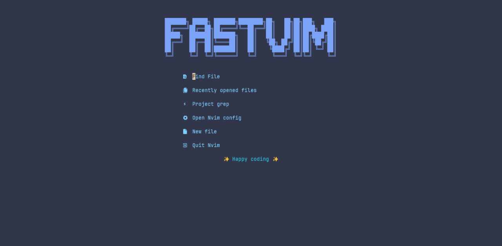

# fastvim 

 
 
 

[](https://www.lua.org/) 


Welcome to Fastvim, the next-gen Neovim distro that’s fast, modern, and totally configurable. Built for lazy folks who don’t want to mess with endless configs, and for the Neovim Martian 👽 hackers who want total control over their setup. Whether you just want things to work out of the box or you love tweaking every little detail, Fastvim’s got your back.

Forget about spending hours setting up your Neovim environment. With Fastvim, you can get started right away, but if you're into customization, it's as flexible as you need it to be. This distro has everything you need for a smooth, efficient workflow, and if you're feeling adventurous, you can dive in and make it your own.

Get ready to experience a Neovim setup that just works, without all the fluff. Let’s get you set up, quick and easy!

- [fastvim ](#fastvim-)
  - [✨ Features](#-features)
  - [💤 Installation](#-installation)
      - [linux or mac](#linux-or-mac)
      - [Windows](#windows)
    - [💻 Setup](#-setup)
    - [Goals](#goals)
  - [🔥 Contributing](#-contributing)
  - [👏 Acknowledgements](#-acknowledgements)



## ✨ Features
- 🔥 Turn your Neovim into a complete IDE.
- 💤 Customize and extend your configuration easily with lazy.nvim
- 🚀 Super fast
- 🧹 Common settings for options, autocms and keymaps
- 📦 Contains a variety of pre-configured and ready-to-use plugins

## 💤 Installation

#### linux or mac

```bash
bash <(curl -s https://raw.githubusercontent.com/fastvim/fastvim/main/install.sh)
```
#### Windows

- powershell

```ps1
iex (iwr -UseBasicParsing https://raw.githubusercontent.com/fastvim/fastvim/main/install.ps1)
```

- cmd

```
powershell -Command "iex (iwr -UseBasicParsing https://raw.githubusercontent.com/fastvim/fastvim/main/install.ps1)"
```
### 💻 Setup

For the distro to work as expected, we need to configure a few things, let's start by downloading the lsp(language server protocol) that you will use by installing with mason

To do this you type: `MasonInstall LspName`

Ex: 

```
:MasonInstall clangd
```

If you are going to use this distro to program in Java, I recommend that you install lsp jdtls through HomeBrew 🍻

To do this, install homebrew by following these steps:
Open the terminal.

Run the following command to install Homebrew:

```bash
/bin/bash -c "$(curl -fsSL https://raw.githubusercontent.com/Homebrew/install/HEAD/install.sh)"
```

The script will download and install Homebrew. During the process, it may ask for administrator permissions (system password).

After installation, you can add Homebrew to your PATH. The script will suggest the exact command to add to your shell configuration file (e.g. .bashrc, .zshrc or .profile):

Add the line below to your shell configuration file (if necessary):

```bash
export PATH="/home/linuxbrew/.linuxbrew/bin:$PATH"
```
After that, run the command to reload the configuration file:

```bash
source ~/.bashrc # Either .zshrc or .profile depending on your shell
```
Verify that the installation was successful:

```bash
brew --version
```
This should return the Homebrew version, confirming the installation was successful.

### Goals

| **Goal** 	| stats 	| 
|-----------------	|------|
|  Have own color scheme               	|   ✅   	|   
|  cross platform support               	|   ✅  	|  
|  add a markdown-mode               	|   ❌  	| 
|  add a neovim web wowser               	|   ❌  	|
|  add a configuration compatibility between vim and neovim               	|   ❌  	|
|  adding specialized config in gamedev               	|   ❌  	| 
|  adding full and more complete documentation               	|   ❌  	|

## 🔥 Contributing

Pull requests are welcome.

That said, there's a bunch of ways you can contribute to this project, like by:

* ⭐ Giving a star on this repository (this is very important and costs nothing)
* 🪲 Reporting a bug
* 📄 Improving this [documentation](./doc/getting_started.md)
* 🚨 Sharing this project and recommending it to your friends
* 💻 Submitting a pull request to the official repository

## 👏 Acknowledgements
 
This project thanks everyone who inspired it

- [doom emacs](https://github.com/doomemacs/doomemacs)
- [doom-nvim](https://github.com/doom-neovim/doom-nvim)
- [space-vim](https://github.com/SpaceVim/SpaceVim)
- [lunar-vim](https://github.com/LunarVim/LunarVim)

