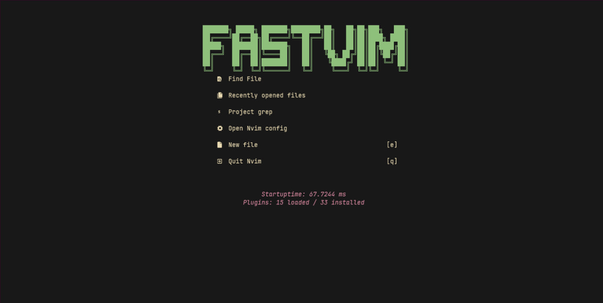

# fastvim

   

🚀 A fast  hyperextensible hackable distro for neovim, made specifically for lazy devs, configure your neovim in a fast and efficient way.



## ✨ Features
- 🔥 Turn your Neovim into a complete IDE.
- 💤 Customize and extend your configuration easily with lazy.nvim
- 🚀 Super fast
- 🧹 Common settings for options, autocms and keymaps
- 📦 Contains a variety of pre-configured and ready-to-use plugins

## Installation

- In linux/mac

```bash
bash <(curl -s https://raw.githubusercontent.com/BrunoCiccarino/fastvim/main/install.sh)
```