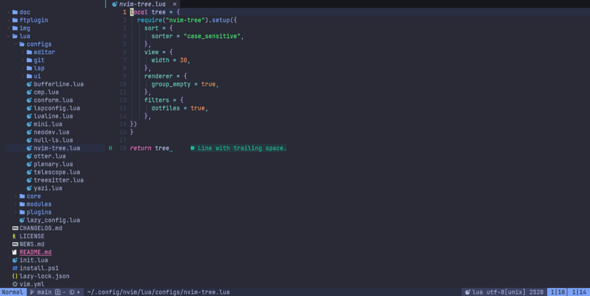

<h1 align="center">
  <br>
  <a href="https://github.com/fastvim/fastvim">
    
  </a>
  <br>
  FastVim  
  <br>
</h1>

<p align="center">
  <a href="https://github.com/fastvim/fastvim">
    
  </a>
    <a href="https://github.com/fastvim/fastvim">
    
  </a>  
  <a href="https://github.com/fastvim/fastvim">
    
  </a>  
  <a href="http://makeapullrequest.com">
    
  </a>  
  <a href="https://github.com/fastvim/fastvim">
    
  </a>  
  <a href="https://github.com/fastvim/fastvim">
    
  </a>  
    <a href="https://github.com/fastvim/fastvim">
    
  </a>  
  <a href="https://t.me/fastvim">
    
  </a>  
  <a href="https://github.com/BrunoCiccarino/nekonight">
    
  </a>  
</p>

Welcome to Fastvim, the next-gen galactic ☄️ Neovim distro that’s fast, modern, and fully configurable. Built for both lazy people who don’t want to mess around with endless configurations, and for the martian 👽 Neovim hackers who want full control over their setup. Whether you just want things to work right out of the box or you love tweaking every little detail, Fastvim is here to help.

This distro has everything you need for a smooth and efficient workflow, and if you’re feeling adventurous, you can dive in and make it your own. With custom themes 🎨 made just for you, if you like having themes for every phase and mood you’re going through, just like me.

Get ready to experience a Neovim setup that just works, without all the hassle. Let’s get you set up, fast and easy!

- [✨ Features](#-features)
- [📦 requirements](#-requirements)
- [💤 Installation](#-installation)
    - [linux or mac](#linux-or-mac)
    - [Windows](#windows)
  - [💻 Setup](#-setup)
  - [Quickstart](#quickstart)
    - [🗺️ keymaps](#️-keymaps)
    - [⚙️  Unified Guide: Customizing FastVim](#️--unified-guide-customizing-fastvim)
  - [Tasks](#tasks)
  - [Goals](#goals)
- [🔥 Contributing](#-contributing)
- [Contributors](#contributors)
- [👏 Acknowledgements](#-acknowledgements)
- [👨‍🏫 Team](#-team)
- [☕ Sponsor this project](#-sponsor-this-project)




## ✨ Features
- 🔥 Turn your Neovim into a complete IDE.
- 💤 Customize and extend your configuration easily with lazy.nvim
- 🚀 Super fast
- 🧹 Common settings for options, autocms and keymaps
- 📦 Contains a variety of pre-configured and ready-to-use plugins

- ⚙️ **LSP (Language Server Protocol)**:
    - 🖥️ **clangd.lua** - clangd server configuration
    - 🌐 **cssls.lua** - CSSLS server configuration
    - 🖥️ **go.lua** - Go server configuration
    - 🌐 **html.lua** - HTML server configuration
    - 🖥️ **java.lua** - Java server configuration
    - 🖥️ **lua.lua** - Lua server configuration
    - 🖥️ **ts_ls.lua** - TypeScript server configuration
    - 🔧 **utils.lua** - LSP utilities

## 📦 requirements 

- Neovim >= 0.9.0 (needs to be built with LuaJIT)
- Git >= 2.19.0 (for partial clones support)
- a Nerd Font(v3.0 or greater) (optional, but needed to display some icons)
- a C compiler for nvim-treesitter. See [here](https://github.com/nvim-treesitter/nvim-treesitter#requirements)

## 💤 Installation

> [!WARNING]
> Please, before installing, remember to make a backup of your dotfiles.

```
mv ~/.config/nvim ~/.config/nvim.bak
mv ~/.local/share/nvim ~/.local/share/nvim.bak 
```

#### linux or mac

```bash
git clone https://github.com/fastvim/fastvim.git ~/.config/nvim 
cd .config/nvim
nvim # Then it will download everything by itself
```
#### Windows

```posh
git clone https://github.com/fastvim/fastvim.git $HOME\AppData\Local\nvim 
```

### 💻 Setup

For the distro to work as expected, we need to configure a few things, let's start by downloading the lsp(language server protocol) that you will use by installing with mason

To do this you type: `MasonInstall LspName`

Ex: 

```
:MasonInstall clangd
```
Or if you are java dev 

```
MasonInstall jdtls
```

Lsp (language server protocol) bring you countless benefits when coding, such as auto completions, syntactic error warnings in real time, and for this we have some plugins like [nvim-cmp](), for snippets we have [ luasnip]() that works exceptionally well and we have mini.pairs to autocomplete special characters like [], (), <>, etc...


With the setup complete, you're now ready to dive into using your new Neovim IDE. Let's get started!

### Quickstart

Now that everything is set up, let's jump into using FastVim. Follow these steps to start coding efficiently:

Open Neovim
Launch Neovim by running:

```bash
nvim
```
Explore the Dashboard
Upon starting Neovim, you'll see a customizable dashboard. Use it to quickly open recent files, create new projects, or access settings.

Install Plugins
Ensure all required plugins are installed by running:

```bash
:Lazy
```
This will display the plugin manager. Press u to update all plugins.

Set Up LSP
If you haven't installed your language server yet, use Mason:

```bash
:MasonInstall <LspName>
```
Replace <LspName> with the appropriate server for your language (e.g., clangd for C/C++, jdtls for Java).

Start Coding
Open a file or create a new one:

```bash
nvim myfile.<extension>
```
Replace <extension> with the file type you're working with (e.g., java, go, sql). Autocompletions, syntax highlighting, and LSP features will be ready to assist you.

**update distro**

To update the distro you have two options, `:FastUpdate` which will update the distro to the latest version, and `:FastStable` which will update the distro to the latest stable version (recommended)

**Explore Keymaps**
This configuration comes with pre-mapped keys for common actions. Check the keybindings guide by pressing:

```bash
:help keymaps
```
You're now ready to enjoy a complete IDE experience with FastVim!

#### 🗺️ keymaps

To make your workflow much more fluid, we created countless keyboard shortcuts both to use the incredible plugins and to move around neovim in a faster and more efficient way.

| shortcut           | action                            |
|--------------------|-----------------------------------|
| \fu                | fast update                       |
| \fs                | fast stable distro update         |
| ctrl-h             | focus_nvimtree                    |
| ctrl-n             | toggle_nvimtree                   |
| \ff                | find_files                        |
| \fo                | recent_files                      |
| \fw                | live_grep                         |
| \gt                | git_status                        |
| Tab                | cycle_buffer_next                 |
| S-Tab              | cycle_buffer_prev                 |
| ctrl-q             | close_buffer                      |
| \/ (Normal)        | toggle_comment_line               |
| \/ (Visual)        | toggle_comment_block              |
| \fm                | format_code                       |
| ctrl-\             | open_themery                      |
| \t                 | split_terminal_horizontal         |
| \tv                | split_terminal_vertical           |
| A-Up (Insert)      | move_line_up                      |
| A-Down (Insert)    | move_line_down                    |
| ctrl-Up (Insert)   | select_line_up                    |
| ctrl-Down (Insert) | select_line_down                  |
| \nw                | neorg_switch_workspace            |
| \nn                | neorg_open_index                  |
| \nt                | neorg_toggle_concealer            |
| \nh                | neorg_toggle_todo                 |
| \nc                | neorg_toggle_concealer_visibility |
| ctrl+t             | open toggle terminal              |

#### ⚙️  Unified Guide: Customizing FastVim 

FastVim introduces two exciting configurable features: seamless theme switching and the File Starter module. Both are simple to set up and give you control over your editor’s behavior. Let’s explore both options!

Configuration Directory
FastVim uses a dedicated directory for configurations, and its location depends on your operating system:

- Linux: `~/.fast.d/`
- Windows: `%AppData%\\.fast.d\\` (this points to the Roaming directory).
Ensure this directory exists before proceeding.

Setting Up Theme Switching
Customize the look of your editor by easily switching themes.

Open the configuration directory for your OS.
Inside .fast.d, ensure there’s an init.lua file (create it if needed).
Add this line to define your desired theme:

```lua
vim.g.define_colorscheme("themename")
```

Replace "themename" with the theme you want, like "gruvbox":

```lua
vim.g.define_colorscheme("gruvbox")
```
Managing the File Starter Module:
The File Starter module is enabled by default, automatically creating Java class files. If performance is your priority, you might want to disable it.

In the same init.lua file, add the following line to disable the module:
```lua
vim.g.auto_create_java_class = false
```

FastVim’s loader will automatically parse the init.lua file in your configuration directory and apply all settings during Neovim startup. No extra steps are required—just define your preferences, and they’ll take effect.

Why Configure These Features?
Theme Switching: Personalize your editor with styles that suit your taste, whether vibrant or minimalist.

Why Disable the File Starter?
Disabling this module removes the overhead associated with automatically creating Java class files. For users who value faster startup times or don’t rely on this feature, disabling it is a practical choice.

This setup ensures flexibility while maintaining simplicity in configuration.


### Tasks

- Handlers:
    - [x] to set default theme
    - [ ] to exclude plugins from config
    - [ ] to add plugins to config
    - [ ] to set env vars
    - [ ] to choose between snacks and mini
    - [ ] to enable or disable one of the lsp
- Ui: 
    - [ ] custom theme for alpha nvim 
- Lsp: 
    - [ ] lsp for astro js
    - [ ] lsp for angular js
    - [ ] lsp for csharp
    - [ ] lsp for godot script 
    - [ ] lsp for haskell
    - [ ] lsp for python
    - [ ] lsp for sveltejs
    - [ ] lsp for vuejs 
- Config loader:
    - [ ] Add asynchronous job to load config in real time

### Goals

| **Goal** 	| stats 	| 
|-----------------	|------|
|  Have own color scheme               	|   ✅   	|   
|  cross platform support               	|   ✅  	|  
|  add a markdown-mode               	|   ❌  	| 
|  add a neovim web wowser               	|   ❌  	|
|  add a configuration compatibility between vim and neovim               	|   ❌  	|
|  adding specialized config in gamedev               	|   ❌  	| 
|  adding full and more complete documentation               	|   ❌  	|
|  adding full and advanced config for java               	|   ❌  	|

## 🔥 Contributing

Pull requests are welcome.

That said, there's a bunch of ways you can contribute to this project, like by:

* ⭐ Giving a star on this repository (this is very important and costs nothing)
* 🪲 Reporting a bug
* 📄 Improving this [documentation](./doc/getting_started.md)
* 🚨 Sharing this project and recommending it to your friends
* 💻 Submitting a pull request to the official repository

## Contributors

This project exists thanks to all the people who contribute. 

<a href="https://github.com/fastvim/fastvim/graphs/contributors">
  
</a>


## 👏 Acknowledgements
 
This project thanks everyone who inspired it

- [doom emacs](https://github.com/doomemacs/doomemacs)
- [doom-nvim](https://github.com/doom-neovim/doom-nvim)
- [space-vim](https://github.com/SpaceVim/SpaceVim)
- [lunar-vim](https://github.com/LunarVim/LunarVim)
- [LazyVim](https://github.com/LazyVim/LazyVim)

## 👨‍🏫 Team 
- [BrunoCiccarino](https://github.com/BrunoCiccarino): wsl-ubuntu

## ☕ Sponsor this project

[](https://buymeacoffee.com/ciccabr9p)
