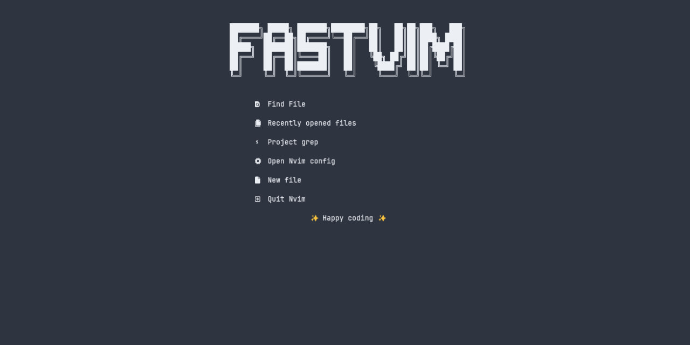

# fastvim 

   [](https://www.lua.org/)

🚀 A fast  hyperextensible hackable distro for neovim, made specifically for lazy devs to increase your productivity by up to 100x, with collections of handpicked plugins configured with quality in mind for your workflow, configure your neovim in a fast and efficient way.



## ✨ Features
- 🔥 Turn your Neovim into a complete IDE.
- 💤 Customize and extend your configuration easily with lazy.nvim
- 🚀 Super fast
- 🧹 Common settings for options, autocms and keymaps
- 📦 Contains a variety of pre-configured and ready-to-use plugins

## Installation

#### In linux/mac

```bash
bash <(curl -s https://raw.githubusercontent.com/fastvim/fastvim/main/install.sh)
```
#### Windows

- powershell

```ps1
iex (iwr -UseBasicParsing https://raw.githubusercontent.com/fastvim/fastvim/main/install.ps1)
```

- cmd

```
powershell -Command "iex (iwr -UseBasicParsing https://raw.githubusercontent.com/fastvim/fastvim/main/install.ps1)"
```

### Goals

| **Goal** 	| stats 	| 
|-----------------	|------|
|  Have own color scheme               	|   ✅   	|   
|  cross platform support               	|   ✅  	|  
|  add a markdown-mode               	|   ❌  	| 
|  add a neovim web wowser               	|   ❌  	|
|  add a configuration compatibility between vim and neovim               	|   ❌  	|
|  adding specialized config in gamedev               	|   ❌  	| 
