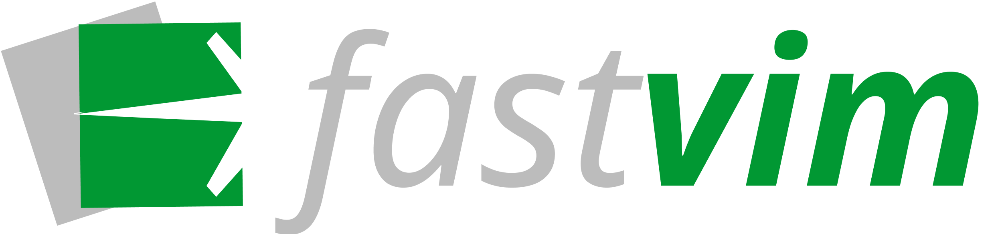

<h1 align="center">
   
  
   
  FastVim  
   
</h1>

  
      
    
    
    
    
      
    
    

Welcome to Fastvim, the next-gen galactic ☄️ Neovim distro that’s fast, modern, and fully configurable. Built for both lazy people who don’t want to mess around with endless configurations, and for the martian 👽 Neovim hackers who want full control over their setup. Whether you just want things to work right out of the box or you love tweaking every little detail, Fastvim is here to help.

This distro has everything you need for a smooth and efficient workflow, and if you’re feeling adventurous, you can dive in and make it your own. With custom themes 🎨 made just for you, if you like having themes for every phase and mood you’re going through, just like me.

Get ready to experience a Neovim setup that just works, without all the hassle. Let’s get you set up, fast and easy!

To find out more about the distro consult our [reference material](https://fastvim.github.io/docs/intro)

### Tasks

- Handlers:
    - [x] to set default theme
    - [ ] to exclude plugins from config
    - [ ] to add plugins to config
    - [ ] to set env vars
    - [ ] to choose between snacks and mini
    - [ ] to enable or disable one of the lsp
    - [ ] fast mode (load only lsp and completion plugins)
- Ui: 
    - [ ] custom theme for alpha nvim 
- Lsp: 
    - [x] lsp for astro js
    - [x] lsp for angular js
    - [ ] lsp for csharp
    - [ ] lsp for godot script 
    - [ ] lsp for haskell
    - [x] lsp for python
    - [x] lsp for sveltejs
    - [x] lsp for vuejs 
- Config loader:
    - [ ] Add asynchronous job to load config in real time

### Goals

| **Goal** 	| stats 	| 
|-----------------	|------|
|  Have own color scheme               	|   ✅   	|   
|  cross platform support               	|   ✅  	|  
|  add a markdown-mode               	|   ❌  	| 
|  add a neovim web wowser               	|   ❌  	|
|  add a configuration compatibility between vim and neovim               	|   ❌  	|
|  adding specialized config in gamedev               	|   ❌  	| 
|  adding full and more complete documentation               	|   ❌  	|
|  adding full and advanced config for java               	|   ❌  	|

## 🔥 Contributing

Pull requests are welcome.

That said, there's a bunch of ways you can contribute to this project, like by:

* ⭐ Giving a star on this repository (this is very important and costs nothing)
* 🪲 Reporting a bug
* 📄 Improving this [documentation](./doc/getting_started.norg)
* 🚨 Sharing this project and recommending it to your friends
* 💻 Submitting a pull request to the official repository

## Contributors

This project exists thanks to all the people who contribute. 

## 👏 Acknowledgements
 
This project thanks everyone who inspired it

- [doom emacs](https://github.com/doomemacs/doomemacs)
- [doom-nvim](https://github.com/doom-neovim/doom-nvim)
- [space-vim](https://github.com/SpaceVim/SpaceVim)
- [lunar-vim](https://github.com/LunarVim/LunarVim)
- [LazyVim](https://github.com/LazyVim/LazyVim)
- [NvChad](https://github.com/NvChad/NvChad)

## 👨‍🏫 Team 
- [BrunoCiccarino](https://github.com/BrunoCiccarino): wsl-ubuntu

## ☕ Sponsor this project

 

Copyright © 2025 fastvim

